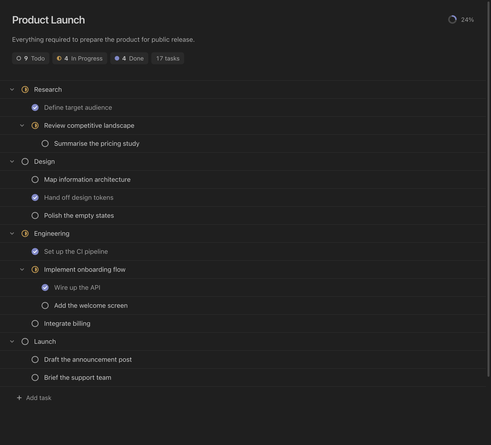

# Plan: .pln Editor

Open a plan file as a task list instead of raw markdown. A `.pln` file is just
markdown with checkboxes: every checkbox line is a task you can click through
three states — todo, in progress, and done — and indenting a line makes it a
subtask of the one above.

The file stays plain text, so it diffs and merges like any other file in your
repository. Everything you do in the editor writes straight back to it.



## Example

```markdown
# Product Launch
Everything required to prepare the product for public release.

- [-] Research
  - [x] Define target audience
  - [-] Review competitive landscape
    - [ ] Summarise the pricing study
- [ ] Launch
  - [ ] Draft the announcement post
```

`[ ]` is todo, `[-]` is in progress, and `[x]` is done. The `#` heading is the
project title and the line under it is the description.

## Install

Search for **Plan: .pln Editor** in the VS Code Extensions view, or install it from the
[Marketplace](https://marketplace.visualstudio.com/items?itemName=CIME-Technologies.pln-editor).

## Usage

Create or open a file ending in `.pln` and it opens in the plan editor. To see
the underlying markdown at any point, use **Reopen Editor With… → Text Editor**.

- **Add a task** with the *Add task* button at the bottom. The name is
  selected so you can type over it right away.
- **Add a subtask** with the `+` button that appears when you hover a task.
  It lands below anything already nested under that task.
- **Change a status** by clicking its circle, which cycles todo → in progress →
  done. The task menu (`⋯`) sets a status directly.
- **Rename** by clicking a task's title, or the project title or description.
  Clearing a task title keeps the task and shows **Untitled**. Clearing the
  project title removes the `#` heading from the file and shows **Untitled**.
- **Delete** from the `⋯` menu. Deleting a task that has subtasks asks first
  and then removes the whole branch.
- **Collapse** a task by clicking its chevron. Collapsed tasks are remembered
  per file.

## Early release

This is version 0.1.3, an early release. It covers tasks, subtasks, statuses,
renaming, and deletion. Anything else you put in a `.pln` file is left untouched
but is not shown in the editor.

Issues and feedback: <https://github.com/CIME-Technologies/pln/issues>

## Development

```bash
npm install
npm test
npm run check
npm run compile
```

To launch the extension locally, open the project in VS Code and press F5
(or **Run and Debug → Run Extension**).

## License

MIT
